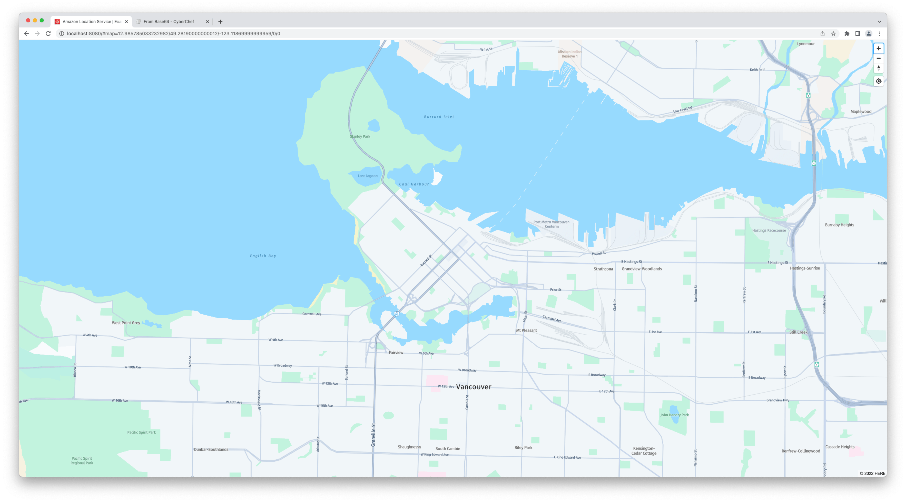

# Amplify Query String Location

This sample shows demonstrates how to create an interactive map that syncs its state with the page URL. The map layer is provided by Amazon Location Service and the application is built with React and Amplify JS.

<p align="center">

Click on the video below to see a demo, or play it [from here](https://www.youtube.com/watch?v=OudD5AMKDFU):

[](https://www.youtube.com/watch?v=OudD5AMKDFU)

</p>

## What do I need?

- Node.js (v16.x or newer) & npm (v8.x or newer)
- An AWS Account and credentials
- [AWS CLI v2](https://docs.aws.amazon.com/cli/latest/userguide/getting-started-install.html) (optional)

> **Warning**
> While all the resources used in this sample have a pay-as-you-go model, please make sure to delete all the resources created to avoid incurring in extra costs. See the "Cleanup" section below for some pointers.

## Deploy backend

## Automated deployment (recommended)

In the `backend` folder you'll find a tiny AWS CDK app that deploys some Amazon Cognito resources to manage authentication/authorization as well as some Amazon Location Service resources (a Map, a Route Calculator, and a Place Index).

You can use CDK to deploy the stack, but if you already have resources in your AWS account or prefer to deploy them by other means, skip to the next section.

```sh
# Change folder to the one that contains the backend files
cd backend
# Install the CDK dependencies
npm i
# Deploy the resources 🚀 (and create a file with the outputs)
cdk deploy --outputs-file cdk.out/params.json
```

Once the stack is deployed, you can query the outputs using the AWS CLI, you'll need these values in the next section.

```sh
aws cloudformation describe-stacks --stack-name AmplifyQueryStringLocationStack --query "Stacks[0].Outputs"
```

### Manual deployment

If you don't want to use CDK to deploy the resources, you'll need to create the following resources:

- 1x Cognito Identity Pool ([more info here](https://docs.aws.amazon.com/cognito/latest/developerguide/identity-pools.html))
- 1x Amazon Location Service Map ([more info here](https://docs.aws.amazon.com/location/latest/developerguide/map-prerequisites.html))
- 1x Amazon Location Service Place Index with `IntendedUse=Storage` ([more info here](https://docs.aws.amazon.com/location/latest/developerguide/places-prerequisites.html))
- 1x Amazon Location Service Route Calculator ([more info here](https://docs.aws.amazon.com/location/latest/developerguide/routes-prerequisites.html))
- 1x IAM Role for unauthenticated users with permissions to interact with the three Location Service resources ([more info here](https://docs.aws.amazon.com/location/latest/developerguide/security_iam_service-with-iam.html))

## Configure and run Frontend

> **Note**
> If you deployed the stack using the provided CDK template, you can also run `npm run copy-params` while in the main directory. This command will execute a node script (in `src/copy-params.js`) that will read the contents of the output file generated by the CDK deploy (in `backend/cdk.out/params.json`) and automatically create the `src/aws-exports.cjs` file for you.

Whether you have deployed the AWS resources with CDK, or by other means, you'll have to create a config file for the frontend application. This config file tells the app how to connect to AWS and which resources to use.

In your favorite text editor, create a file in `src/aws-exports.cjs`, and use the template below to fill it:

> **Note**
> Make sure to replace all the values in the file with the ones from your AWS environment!

```js
/* eslint-disable */

const awsmobile = {
  aws_project_region: "AWS_REGION",
  aws_cognito_identity_pool_id: "COGNITO_IDENTITY_POOL_ID",
  aws_cognito_region: "AWS_REGION",
  aws_user_pools_id: "COGNITO_USER_POOL_ID",
  aws_user_pools_web_client_id: "COGNITO_CLIENT_ID",
  geo: {
    amazon_location_service: {
      region: "AWS_REGION",
      maps: {
        items: {
          MAP_NAME: {
            style: "MAP_STYLE",
          },
        },
        default: "MAP_NAME",
      },
      search_indices: {
        items: ["PLACE_INDEX_NAME"],
        default: "PLACE_INDEX_NAME",
      },
      routeCalculator: "ROUTE_CALCULATOR_NAME",
    },
  },
};

export default awsmobile;
```

Once this is done, using your terminal, and while in the root directory, run:

```sh
# Install the dependencies of the frontend app
npm i
```

Then, when it's done, start the application by running:

```sh
npm start
```

You should now be able to see the app by visiting [`http://localhost:8080`](http://localhost:8080) with your favorite browser.

Want to deploy the application to the cloud? Check out [Amplify Hosting](https://docs.amplify.aws/start/getting-started/hosting/q/integration/js/)!

## Want to know more?

Let's dive a bit deeper on how the map stores info in the browser URL.

### Syncing the map with the page url

When you start the application, if no information are passed, the application will use a default location (currently Vancouver, CA).


If you notice the browser you'll see that the URL looks like this:

```
http://localhost:8080/#map=11/49.2819/-123.1187/0/0
```

The first part is the base url: `http://localhost:8080`. Let's instead focus on the second part `#map=11/49.2819/-123.1187/0/0`. This is called [`location.hash`](https://developer.mozilla.org/en-US/docs/Web/API/Location/hash) and it's often used to either point to specific section of the page, or in some cases as a mean to convey information.

In our case we are storing 5 values, respectively:

- Zoom level
- Latitude
- Longitude
- Pitch
- Bearing

Let's now try to move the map around a bit or change zoom level.



You will notice that the URL in of your browser is updated every time you stop interacting with the map. This is already a big deal becasue it allows you to store the map state in the page url. Try for example to copy the url and open it in another browser tab! You'll see that the new tab opens to the same position, zoom, and pitch of the previous one.

Now, those of you who are familiar with `react-map-gl`, which is the mapping library used by Amplify UI, will probably know that the library exposes this type of functionality via a prop aptly called [`hash`](https://visgl.github.io/react-map-gl/docs/api-reference/map#hash). When this prop equals to `true` the map will automatically sync its state with the page url. In this sample however, we are not using this prop. In fact, if you go check the `src/App.tsx` file in which the `MapView` component is declared, you'll notice that we never pass the `hash` prop.

When I started working on this sample I played with the `hash` prop a bit and it worked great, however I was not able to store additional data in the url (more on this in a second) as every time I moved the map, the hash would get overwritten with the same view data that belong to the map.

So I decided to roll my own logic that observes the page URL and the `onMoveEnd` event of the map and keeps them in sync.

### Adding additional data

For the second part of my experiment I wanted to see if I could store additional data in the hash and keep it in sync with the map displayed on the page. My goal was being able to create a page url that would allow two people to exchange a route that was displayed on a map.

Looking at the response object returned by the [Amazon Location Service CalculateRoute API](https://docs.aws.amazon.com/location/latest/APIReference/API_CalculateRoute.html#API_CalculateRoute_ResponseSyntax), the information that I needed was contained in the `Legs.Geometry[]` field. However, this field contains a list of `LineString` GeoJSON-like features which could become very long real fast. Additionally, I wasn't sure on whether keeping this data in the page url would be considered as storage, so I decided to not pursue this route (pun intended 🤓).

> **Note**
> When using an AWS Service, is always a good idea to check the [AWS Service Terms](https://aws.amazon.com/service-terms/) related to that service. In the case of Amazon Location Service, section 82.3.e explicitly calls out the fact that you cannot store or cache location data except for the one returned by a Place Index (disclaimer: none of this is legal advice!).

When using Amazon Location Service, we can store the results of a Place Index as long as we specify that we intend to store this data when creating the resource. This has cost implications that you should review and consider, but for all intents and purposes this is exactly what I was looking for!

Since we cannot directly store the result of a Route Calculator API call, I decided instead to store a collection of points that represent the different waypoints of a route and calculate the route between them each time the page is loaded. Again, this is maybe not the most optimal setup cost-wise, but at least it allows to comply with the service terms.

Each waypoint in a route is a set of coordinates represented by two numbers: a longitude and a latitude. These numbers can be integers or float numbers with positive or negative value. If you want to know more about coordinate systems, check [this Wikipedia entry](https://en.wikipedia.org/wiki/Geographic_coordinate_system).

Generally speaking, when it comes to store data in a page url there are certain symbols such as `.` or `/` that might confuse the browser and break the page. For this reason it's always a good idea to [escape](https://developer.mozilla.org/en-US/docs/Web/JavaScript/Reference/Global_Objects/encodeURI) any string that you intend to put in a url.

In this sample I decided to [encode the data as base64](https://en.wikipedia.org/wiki/Base64). While this conversion can make the string actually longer, it has the nice side effect of making it completely opaque and safe for transport. Also, I really wanted to play with the [`@aws-sdk/util-base64-browser`](https://docs.aws.amazon.com/AWSJavaScriptSDK/v3/latest/modules/_aws_sdk_util_base64_browser.html) of the AWS SDK for JavaScript v3.

If you start clicking on the map you'll see that the application allows you to add markers. When there are two or more markers, the app automatically calculates the route between each pair of points and displays it on the map.


Additionally, it also updates the page url:

```
http://localhost:8080/#map=14.721178578476804/49.27572081562974/-123.14124000000004/0/0&route=LTEyMy4xNzMyNjA3MjM1OTcsNDkuMjY4Mzk2NzYwMDcxOTk0JC0xMjMuMTA5MDYxNTEyNTQ5NTcsNDkuMjgyNTQ1NTkyNDYyNw==
```

If we look closely, the second half of the url has a string that starts with `route=`:

```
route=LTEyMy4xNzMyNjA3MjM1OTcsNDkuMjY4Mzk2NzYwMDcxOTk0JC0xMjMuMTA5MDYxNTEyNTQ5NTcsNDkuMjgyNTQ1NTkyNDYyNw==
```

The value for this parameter is a seemingly random string of text. This text is actually a base64 representation of a sequence of markers separated by a `$` symbol:

```
LTEyMy4xNzMyNjA3MjM1OTcsNDkuMjY4Mzk2NzYwMDcxOTk0JC0xMjMuMTA5MDYxNTEyNTQ5NTcsNDkuMjgyNTQ1NTkyNDYyNw==
```

If we take this string and decode it (there are base64 encoder/decoder you can find online), you'll get a string that looks like this:

```
-123.173260723597,49.268396760071994$-123.10906151254957,49.2825455924627
```

These two points above are actually the markers that you see on the page!

## Cleanup

When you're done playing with the sample, make sure to clean up the resources that were created.

If you deployed the AWS resources using the recommended and automated method, you can simply use CDK once again to delete the stack:

```sh
# Change directory
cd backend
# Delete the stack (follow the prompts)
cdk destroy
```

If instead you created the resources manually or via other means, you'll have to go in the AWS Console and delete each resource.
